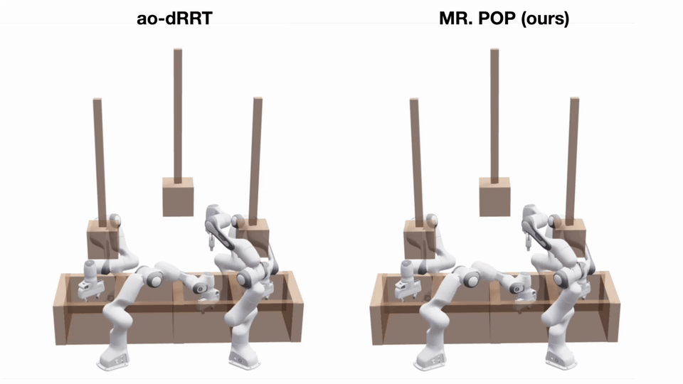

[](https://arxiv.org/abs/2609.30644)
[](https://www.youtube.com/watch?v=TOUWF6pqbAw)

# MR. POP: Multi-Robot Parallel Optimizing Planner

This repository hosts the code for "**MR. POP**: **M**ulti-**R**obot **P**arallel
**O**ptimizing **P**lanner for Almost-Surely Asymptotically Optimal Planning."

<p align="left">
  
</p>

MR. POP is a GPU-based multi-robot asymptotically optimal planner that combines
the multi-robot planner [dRRT](https://journals.sagepub.com/doi/full/10.1177/0278364915615688)
with the [AO-x meta-algorithm](https://ieeexplore.ieee.org/abstract/document/7588078).
Compared to other multi-robot SIMD and SIMT-accelerated planners, our empirical
evaluation shows that MR. POP is the only planner that consistently achieves a
100% problem solve rate while converging to paths of lower cost orders of
magnitude faster.

## Build

The existing compiler settings target **CUDA architecture 120**. Adjust the
setting in `CMakeLists.txt` when building for different hardware. CUDA separable
compilation is enabled so the planner and path simplifier can share device
state and collision routines across their compilation units.

```sh
cmake -S . -B build
cmake --build build -j
```

This builds both `evaluate_mr` and `export_seeds`.

## Run benchmarks

This checkout supports two benchmarks based on
[prior benchmarks](https://arxiv.org/html/2404.00143v1):

| Robot argument | Scene | Arms | Total degrees of freedom | Problems |
| --- | --- | --- | --- | --- |
| `panda_four` | Bin packing | 4 | 28 | 50 |
| `panda_five` | Shelf reaching | 5 | 35 | 50 |

Run from the repository root so the executables can find `scripts/*_problems.json`.
Create the output directory before running `evaluate_mr`:

```sh
mkdir -p test_output
./build/evaluate_mr panda_four mr_pop
./build/evaluate_mr panda_five mr_pop
```

The CSVs are saved as `test_output/panda_four_mr_pop.csv` and
`test_output/panda_five_mr_pop.csv`. Each row contains the solve result,
timing, selected settings, and path configurations.

## Export paths as text

```sh
./build/export_seeds panda_four test_output/panda_four_seeds 6
./build/export_seeds panda_five test_output/panda_five_seeds 6
```

The exporter creates its output directory and writes one waypoint per line,
with space-separated joint angles in radians. Each solved problem produces
`<name>.txt` for its final path and additional
`<name>__k00__cost<c>.txt`, `__k01__`, and subsequent files for solutions recorded
during optimization. Failed problems produce no path files.

The full command is:

```text
export_seeds <robot_name> <out_dir> [rrtc_iter] [optimize_iters]
```

`rrtc_iter` defaults to 6; 1 requests the initial solve only, while larger
values add optimizing passes. `optimize_iters` defaults to 400000 and sets the
iteration budget for those optimizing passes. The exporter explicitly enables
PHS sampling and path simplification.

## Code layout

| File or directory | Purpose |
| --- | --- |
| `src/planning/pop_planner.cu` | Roadmap construction, tree growth, solve orchestration, and owning device state |
| `src/planning/path_processing.cu` | Connected-tree path tracing, merging, and copying into planner results |
| `src/planning/path_simplification.cu` | Path smoothing and shortcutting kernels and their host launcher |
| `src/planning/pop_planner_state.cuh` | Shared device-state declarations and buffer limits |
| `src/planning/pop_settings.hh` | Planner settings and defaults |
| `src/planning/Planners.hh` | `PlannerResult` and the `dRRT::solve` declaration |
| `src/planning/roadmap_interior.cuh`, `utils.cuh` | Roadmap and collision helpers |
| `src/robots/` | Panda arm geometry, multi-arm base transforms, and collision specializations |
| `src/collision/` | Obstacle shapes, factories, environments, and collision declarations |
| `scripts/` | The two executables and their Four/Five benchmark data |

## Parameter choices

| Parameter | Main idea | Location
| --- | --- | ---|
| `ROADMAP_BUILD_ITER` |  Roadmap growth iterations between component propagation and connectivity checks. Larger batches reduce propagation overhead but delay detecting a connection. | `src/planning/roadmap_interior.cuh`
| `settings.num_new_configs` |  Parallel tree-extension attempts per iteration. Larger batches provide more concurrent exploration and use more GPU resources. |`scripts/evaluate_mr.cu` or `scripts/export_seeds.cu`
| `settings.granularity` |  Interpolation samples per edge for collision checking. This value should match BATCH_SIZE in the robot's header file (eg. panda.cuh, panda_four.cuh) |`scripts/evaluate_mr.cu` or `scripts/export_seeds.cu`
| `settings.range` | Joint-space extension range, measured using Euclidean distance in radians. Larger values allow longer steps; smaller values lead to finer exploration. |`scripts/evaluate_mr.cu` or `scripts/export_seeds.cu`
| `settings.rrtc_iter` | Total planning passes: the first finds an initial solution; later passes seek shorter paths at the cost of more runtime. |`scripts/evaluate_mr.cu` or `scripts/export_seeds.cu`
